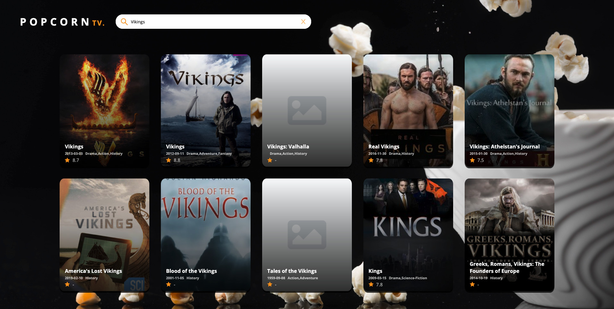

### POPCORNTV
<a href="https://popcorntv.netlify.app" target="_blank">Live preview</a>

A tv shows library created using the <b>tvmaze</b> public free api, using <b>react</b> alongisde <b>typescript</b>.

This project is just for fun & a way to practice using <b>react</b> with <b>typescript</b>.

